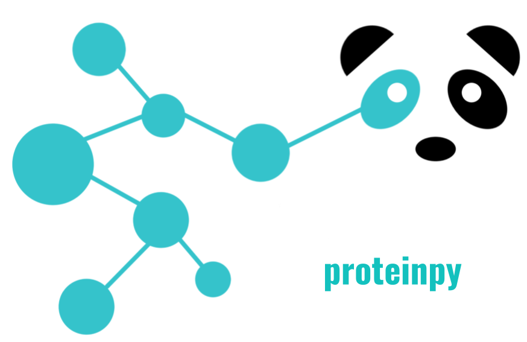
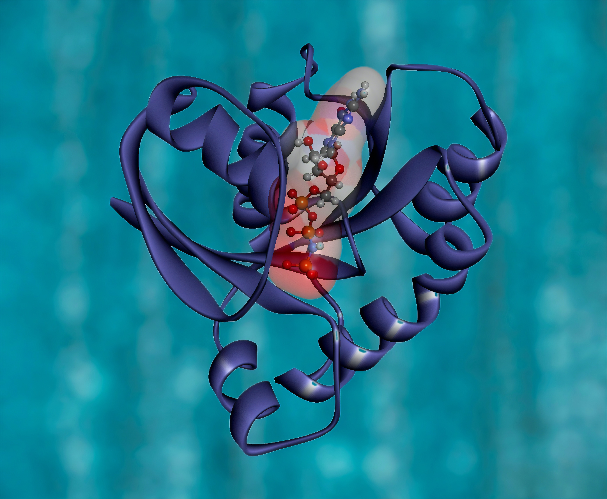

<!--  -->
<!-- *(Photo by <a href="https://unsplash.com/@nci?utm_source=unsplash&utm_medium=referral&utm_content=creditCopyText">National Cancer Institute</a> on <a href="https://unsplash.com/?utm_source=unsplash&utm_medium=referral&utm_content=creditCopyText">Unsplash</a>)</p>* -->

# proteinpy - handling protein structures using dataframes
**`proteinpy`** is a bioinformatic package for parsing and analysis of protein structure data (`PDB`, `DSSP` and `CCP4` format) using pandas dataframes. This is a tool developed for my research work on computational protein structural physics. In structural biology, there hasn't been a handy Python package that converts PDB files to pandas dataframe, which allows using various machine learning methods to get biophysical insights from PDB bank. Therefore I decided to create this package.<br></br>

## Installation and Usage
**`proteinpy`** can be installed from Github by cloning this repository to your local directory.
```
git clone https://github.com/haocai1992/proteinpy.git
```
If you don't have git, install git (on Linux) before cloning:
```
sudo apt-get install git
```
After cloning this repository, run the following code:
```
cd proteinpy
sudo python setup.py install
```
Replace `python` with your specific version if required, for example `python3`, or `pypy3`.

## Usage and Examples
### Import **`proteinpy`** package
Before using **proteinpy**, you will need to import it in your python file:
```
from proteinpy import *
```
### Parse `PDB/DSSP/CCP4` file
 You can parse your local files into a `Parser` object in one line:
```
# Parse local PDB (and DSSP/CCP4) file in your local directory.
parser = Parser('3eiy')
```
### Use `Structure` class to analyze protein structures
Then, you can analyze protein structures using dataframe:
```
# protein structure dataframe.
structure = parser.structure
```
You can get dataframes for different sets of atoms in this structure:
```
# all atoms.
allatoms = structure.allatoms

# all residue atoms.
resatoms = structure.resatoms

# all water (oxygen) atoms.
waters = structure.waters

# all "buried" water atoms - water that are not exposed to 
# the external surface.
buriedwaters = structure.buriedwaters
```
You can also get the 3D coordinates (x, y, z) of a specified atom in the structure:
```
special_atom = '3eiy.A.3.ARG.CA'
special_atom_coords = structure.get_coordinate(special_atom)
```
### Use `Contact` class to study protein-protein and protein-water interactions
The main purpose of my research was to look at intra-molecular interactions. Therefore I created a `Contact` class to store interactions between atoms:
```
# protein contact dataframe.
contact = parser.contact
```
You can get dataframes for different kinds of atom-atom contacts:
```
# all-to-all atom contact.
all2all_contact = contact.all2all

# residue-to-residue contact.
res2res_contact = contact.res2res

# water-to-water contact.
water2water_contact = contact.water2water

# water-to-residue contact.
water2res_contact = contact.water2res
```
For any two atoms in contact, you can also get a (x, y, z) vector connecting them.
```
# get a vector for two atoms.
vec = contact.get_vector(atom1='3eiy.A.3.ARG.CA',\
						 atom2='3eiy.A.12.LYS.CB')
```
### Use `Network` class to explore interaction network in protein structure
In protein structure, every atom interaction with other atoms and forms a interaction network. I created a `Network` class to represent this network:
```
# protein contact network.
network = parser.network
```
I use Python's [`NetworkX`](https://github.com/networkx/networkx) package to store network data, and also to explore special shapes, for example water tetrahedrons, pentagons, and hexagons within this network:
```
# entire network of all atom-atom contacts.
allnet = network.allnet

# water network in protein structure.
waternet = network.waternet

# water tetrahedrons.
watertetrahedrons = network.watertetrahedrons

# water pentagons.
waterpentagons = network.waterpentagons

# water hexagons.
waterhexagons = network.waterhexagons
```
You can also use functions in [`NetworkX`](https://github.com/networkx/networkx) to get graph-related biophysical features:
```
# Number of water oxygen atoms in water network.
num_atoms = waternet.number_of_nodes()

# Number of hydrogen bonds in water network.
num_hbonds = waternet.number_of_edges()

# See how many hydrogen does one water have with other water atoms.
selected_water_num_hbonds = waternet.degree(['3eiy.A.100.HOH.O'])
```

## Future Improvements
**proteinpy** was built mainly for geometric analysis for intra-molecular protein interactions. Currently, it is not capable to perform tasks such as calculating the accessible surface area of a residue, or superimposing two structures. Future improvements include:
* Fetching PDB/DSSP/CCP4 files from rcsb.org instead of locally
* Visualization of protein networks
* More strcutural biology calculations

## Contact
* **Author**: Hao Cai
* **Email**: haocai3@gmail.com
* **Google Scholar**: https://scholar.google.com/citations?user=WueH2rAAAAAJ&hl=en
* **Linkedin**: https://www.linkedin.com/in/haocai1992/
